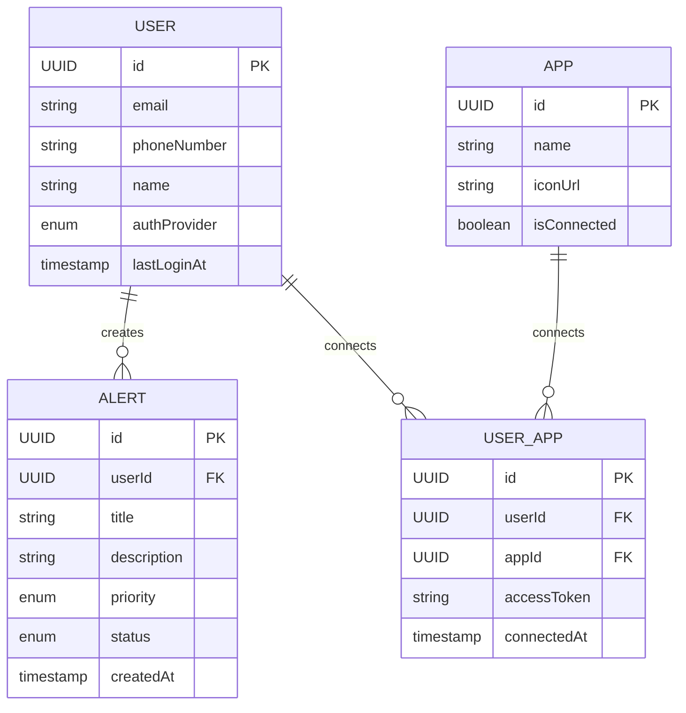
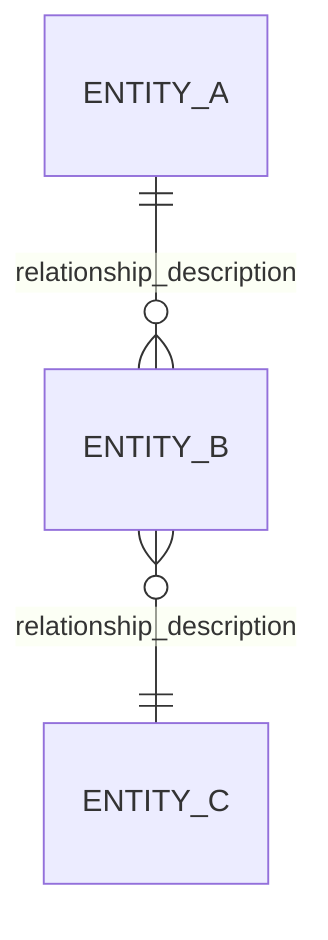

# What Is a Backend Schema? (Data Model & Database Design)

## 1. Overview

A **Backend Schema** (also called a **Data Model**, **Database Schema**, or **Entity-Relationship Diagram (ERD)**) is a structural definition of how your application stores, organizes, and relates data. It answers the question:

- *"What data does the app store, and how are those pieces connected?"*

If the **PRD** defines *what* you're building, the **AppFlow** defines *where* users go, the **Design Brief** defines *how it looks*, and the **TDD** defines *how it's built technically*, the **Backend Schema** defines the **foundation of your data layer**—tables, fields, relationships, indexes, and constraints.

In **AI-assisted ("vibe") coding**, the Backend Schema is the blueprint that tells the AI exactly which database models, Prisma/SQLAlchemy schemas, or Mongoose models to generate, preventing it from inventing incorrect relationships or duplicating data.

---

## 2. Why a Backend Schema Matters

| Benefit | Explanation |
| :--- | :--- |
| **Data Integrity** | Enforces constraints (foreign keys, uniqueness, required fields) to prevent bad data. |
| **Performance** | Proper indexing and normalization ensure fast queries as the app scales. |
| **Clarity** | Provides a single source of truth for all data relationships (who owns what). |
| **Developer Speed** | Engineers and AI agents can quickly understand the data layer and build queries/APIs confidently. |
| **Security** | Defines access boundaries (e.g., "User data is scoped to `userId`"). |
| **AI Agent Accuracy** | An AI with a complete schema will generate correct database queries, migrations, and ORM models without guesswork. |

---

## 3. Key Components of a Backend Schema

### 3.1. Entity Definitions (Tables / Collections)
Each entity represents a core object in your system. For each entity, define:

- **Entity Name**: Singular, descriptive (e.g., `User`, `Message`, `Alert`).
- **Description**: What this entity represents in plain English.
- **Primary Key**: The unique identifier (usually `id` with `UUID` or auto-incrementing integer).

### 3.2. Fields (Columns / Attributes)
For each entity, define:

| Field Property | Explanation |
| :--- | :--- |
| **Field Name** | camelCase or snake_case (following project conventions). |
| **Data Type** | `string`, `integer`, `float`, `boolean`, `timestamp`, `JSON`, `UUID`, etc. |
| **Constraints** | `required` / `optional`, `unique`, `default` value. |
| **Description** | What this field stores (e.g., "User's full display name"). |
| **Example Value** | A concrete example (e.g., `"John Doe"`, `"+1234567890"`). |

### 3.3. Relationships
Define how entities relate to each other:

| Relationship | Notation | Example |
| :--- | :--- | :--- |
| **One-to-One** | `1:1` | `User` ↔ `Profile` |
| **One-to-Many** | `1:N` | `User` → `Alert` (one user has many alerts) |
| **Many-to-Many** | `M:N` | `User` ↔ `App` (many users can connect to many apps, through a junction table like `UserApp`) |

For each relationship, specify:
- **Foreign Key**: Which field references another table's primary key.
- **Cascade Behavior**: What happens on delete (`CASCADE`, `SET NULL`, `RESTRICT`).

### 3.4. Indexes
Define which fields need indexes for fast queries:

- **Single-column indexes**: For frequently filtered fields (e.g., `email`, `phoneNumber`).
- **Composite indexes**: For combined filters (e.g., `(userId, createdAt)`).
- **Unique indexes**: For enforcing uniqueness (e.g., `email` must be unique).

### 3.5. Enums
Define shared value sets (e.g., `Status = ['PENDING', 'ACTIVE', 'ARCHIVED']`, `Priority = ['LOW', 'MEDIUM', 'HIGH', 'CRITICAL']`).

### 3.6. Audit Fields
Standard timestamps that every table should include:

| Field | Purpose |
| :--- | :--- |
| `createdAt` | When the record was created. |
| `updatedAt` | When the record was last modified. |
| `deletedAt` | Soft-delete marker (optional, if using soft deletes). |

---

## 4. Backend Schema Documentation Format

### 4.1. Recommended Structure

For each entity, use the following format:

### Entity: User

**Description**: Represents an authenticated user in the system.

| Field | Type | Constraints | Description | Example |
| :--- | :--- | :--- | :--- | :--- |
| `id` | `UUID` | PK, required | Unique identifier | `'550e8400-e29b-41d4-a716-446655440000'` |
| `email` | `string` | unique, optional | User's email address | `'alice@example.com'` |
| `phoneNumber` | `string` | unique, optional | E.164 formatted phone | `'+1234567890'` |
| `name` | `string` | optional | Display name | `'Alice Johnson'` |
| `authProvider` | `enum` | required | `'EMAIL_PASSWORD'` | `'GOOGLE'` |
| `lastLoginAt` | `timestamp` | optional | Last successful login | `'2026-08-07T10:30:00Z'` |
| `createdAt` | `timestamp` | default: `now()` | Record creation time | `'2026-08-07T10:00:00Z'` |
| `updatedAt` | `timestamp` | auto-update | Record modification time | `'2026-08-07T10:30:00Z'` |

**Relationships**:
- `1:N` → `Alert` (one user has many alerts, via `userId` foreign key)
- `M:N` → `App` (through `UserApp` junction table)

**Indexes**:
- `email` (unique)
- `phoneNumber` (unique)
- `authProvider`

### 4.2. Visual Diagrams (ERD) — Detailed Explanation
Visual diagrams are essential for communicating complex relationships at a glance. They are far more efficient than reading pages of text.

### A. Why Use Visual Diagrams?

Instant comprehension: A picture of your schema is worth a thousand lines of code.

AI-friendly: AI agents parse Mermaid/ASCII diagrams effectively.

Team alignment: Non-technical stakeholders can understand relationships without reading SQL.

### B. Recommended Tools

| Tool | Best For | Output Format |
| :--- | :--- | :--- |
| **Mermaid** | Inline diagrams in markdown files (native to GitHub/GitLab). | Live-rendered in most markdown viewers. |
| **[dbdiagram.io](https://dbdiagram.io)** | Quick, browser-based design and export. | PDF, PNG, SQL scripts. |
| **[Draw.io / diagrams.net](https://diagrams.net)** | Drag-and-drop for complex diagrams. | PNG, SVG, XML. |
| **ASCII Art** | Simple, text-only diagrams for docs without rendering support. | Plain text. |
| **[PlantUML](https://plantuml.com)** | Text-to-diagram styling for UML and workflow charts. | PNG, SVG, LaTeX. |

### C. Mermaid ERD Syntax Example


### D. ASCII Art Example (for environments without rendering)

```text
+-------------------+              +-------------------+

|       USER        |              |       ALERT       |
+-------------------+              +-------------------+

| id (PK)           |<-------------| id (PK)           |
| email             |     1:N      | userId (FK)       |
| phoneNumber       |              | title             |
| name              |              | description       |
| authProvider      |              | priority          |
| lastLoginAt       |              | status            |
| createdAt         |              | createdAt         |
| updatedAt         |              | updatedAt         |
+-------------------+              +-------------------+
          |
          | M:N
          |
+-------------------+              +-------------------+

|     USER_APP      |              |        APP        |
+-------------------+              +-------------------+

| id (PK)           |              | id (PK)           |
| userId (FK)       |------------->| name              |
| appId (FK)        |              | iconUrl           |
| accessToken       |              | isConnected       |
| connectedAt       |              +-------------------+
+-------------------+
```
### E. Best Practices for ERDs

- Keep it simple: Avoid diagramming every single table on one page; group by domain (e.g., "Auth Domain," "Notification Domain").

- Include cardinality: Always label relationships (1:1, 1:N, M:N).

- Color-code: Use colors to distinguish entity types (e.g., purple for user-related, blue for system).

- Update with code: Keep your ERD in sync with your schema migrations.

## 5. Backend Schema vs. Other Documents — Detailed Comparison
   Understanding how the Backend Schema fits with other docs is critical to avoid overlaps and gaps.


| Document | Focus | Primary Audience | When to Write | Key Output |
| :--- | :--- | :--- | :--- | :--- |
| **PRD (Product Requirements)** | *What and why* (business logic, user value, success metrics). | PMs, Designers, Devs, QA | First | User stories, requirements, KPIs |
| **AppFlow (User Journeys)** | *Where and when* (screens, navigation, state transitions). | Designers, Frontend Devs, QA | After PRD | Screen maps, navigation logic, state diagrams |
| **Design Brief (UI/UX)** | *How it looks and feels* (colors, fonts, spacing, brand). | Designers, Frontend Devs | After AppFlow | Color tokens, typography, component styles |
| **Backend Schema** | *What data is stored and how it relates* (tables, fields, relationships). | Backend Devs, DB Admins, AI | Alongside TTD | ERD, table definitions, indexes |
| **TDD (Technical Design)** | *How the system works* (architecture, APIs, infrastructure, services). | Backend/Fullstack Devs, Architects | Alongside Schema | API specs, service layers, deployment plans |
| **References.md** | External context (API docs, ORM docs, book references). | Everyone | Before coding | Links to external docs |

Key insight: The Backend Schema and TDD are written in parallel. The Schema defines the data layer, while the TDD defines everything around it (APIs, services, real-time, caching). They are inseparable.

## 6. Best Practices for Designing a Backend Schema — Detailed Guide


| Practice | Why It Matters | How to Apply |
| :--- | :--- | :--- |
| **Normalize to 3NF (Third Normal Form)** | Prevents duplicate data, ensures consistency. | Split repeated data into separate tables (e.g., user addresses in an `Addresses` table). |
| **Use UUID over integer IDs** | Safer for distributed systems; prevents enumeration attacks (users can't guess IDs). | Use `UUID` as primary key in PostgreSQL/MySQL. |
| **Prefer soft deletes** | Preserves audit trails, allows recovery. | Use a `deletedAt` timestamp; filter out in queries. |
| **Add indexes early** | Prevents performance nightmares as data grows. | Profile your queries; index `WHERE`, `ORDER BY`, and `JOIN` columns. |
| **Always include `createdAt` / `updatedAt`** | Essential for debugging, auditing, and analytics. | Use database defaults (`CURRENT_TIMESTAMP`). |
| **Define enums explicitly** | Prevents invalid data from entering the database. | Use `CHECK` constraints or PostgreSQL `ENUM` types. |
| **Think about future scalability** | Plan for partitioning/sharding from the start, even if you don't implement immediately. | Choose partition keys wisely (e.g., `userId`, `tenantId`). |
| **Separate sensitive data** | Encrypt PII (email, phone) at rest, or store in a separate table with restricted access. | Use specialized columns, separate schemas, or dedicated vault services. |
| **Use consistent naming conventions** | Follow your ORM's default or team standards. | Example: PostgreSQL: `snake_case` tables, `snake_case` columns. |
| **Document all constraints** | Write down why constraints exist. | Example: "Unique email ensures no duplicate user accounts." |
| **Design for joins** | Avoid overly deep relationship chains (more than 3-4 joins can be slow). | Denormalize where performance matters. |
| **Use JSON sparingly** | JSON fields are flexible but break queryability. | Use them only for flexible, rarely-queried data (e.g., user preferences). |


#### Example of a bad index strategy: Indexing every single column → bloated index size and slow inserts. Good strategy: Index columns used in WHERE clauses and foreign keys.

## 7. Sample Backend Schema Skeleton (For Your Starter Kit) — Complete Template

You can include this template in your vibe-coding starter kit as docs/BackendSchema_Template.md. It is ready to be filled out for any new project. (This is strictly an example,)

# Backend Schema: [Product/App Name]

## 1. Entity-Relationship Diagram (ERD)

### Mermaid Diagram


### Key Relationships Summary
- [Entity A] → [Entity B] : [Relationship type + explanation]

## 2. Entity Definitions
### Entity: User
Description: Represents an authenticated user.


| Field | Type | Constraints | Description | Example |
| :--- | :--- | :--- | :--- | :--- |
| `id` | `UUID` | PK, required | Unique identifier | `'550e8400-...'` |
| `email` | `string` | unique, optional | Email address | `'alice@example.com'` |
| `phoneNumber` | `string` | unique, optional | Phone with country code | `'+1234567890'` |
| `name` | `string` | optional | Display name | `'Alice Johnson'` |
| `authProvider` | `enum` | required | Auth method | `'EMAIL_PASSWORD'` |
| `lastLoginAt` | `timestamp` | optional | Last login timestamp | `'2026-08-07T10:30:00Z'` |
| `createdAt` | `timestamp` | default: `now()` | Creation time | `'2026-08-07T10:00:00Z'` |
| `updatedAt` | `timestamp` | auto-update | Last modification | `'2026-08-07T10:30:00Z'` |

#### Relationships:

1:N → Alert via userId

M:N → App via UserApp

#### Indexes:

email (unique)

phoneNumber (unique)

#### Entity: Alert
Description: Represents a triggered notification or message from a connected app.


| Field | Type | Constraints | Description | Example |
| :--- | :--- | :--- | :--- | :--- |
| `id` | `UUID` | PK, required | Unique identifier | `'550e8400-...'` |
| `userId` | `UUID` | FK, required | Owner | `'550e8400-...'` |
| `title` | `string` | required | Alert title | `'Critical: Server Down'` |
| `description` | `text` | optional | Full description | `'Service is unresponsive...'` |
| `priority` | `enum` | required | `'LOW'`, `'MEDIUM'`, `'HIGH'`, `'CRITICAL'` | `'HIGH'` |
| `status` | `enum` | required | `'OPEN'`, `'ACKNOWLEDGED'`, `'RESOLVED'` | `'OPEN'` |
| `sourceApp` | `string` | required | App that triggered it | `'Gmail'` |
| `createdAt` | `timestamp` | default: `now()` | Creation time | `'2026-08-07T10:00:00Z'` |


---

## 8. For AI-Assisted ("Vibe") Coding

When using a Backend Schema in a vibe-coding workflow, it directly informs the ORM models and database migrations. Here's how to optimize it for AI agents:

1.  **Map to your ORM**: Tell the AI which ORM you use (Prisma, Drizzle, TypeORM, SQLAlchemy, Mongoose). The schema becomes the `schema.prisma` file or the Mongoose model definitions.
2.  **Be explicit about data types**: SQL vs NoSQL types differ; explicitly state "This is PostgreSQL, so use `Text` for strings and `DateTime` for timestamps."
3.  **Define foreign key constraints explicitly**: Tell the AI whether to `CASCADE` on delete or `SET NULL`.
4.  **Add seed data**: If the schema requires initial data (e.g., default roles), include that in the schema documentation.
5.  **Link to security rules**: Remind the AI that every user-owned table must have a `userId` foreign key and be scoped in queries.
6.  **Provide a migration command**: Tell the AI the exact command to run migrations (e.g., `npx prisma migrate dev`).

---

## 9. Relationship to Your Starter Kit Documents

Here is how the Backend Schema completes your documentation suite for vibe coding:

| Document | Purpose |
| :--- | :--- |
| **PRD** | *What* and *why* (requirements, business logic). |
| **AppFlow** | *Where* and *when* (screens, navigation, user journeys). |
| **Design Brief** | *How it looks and feels* (visual identity, brand, UI tokens). |
| **Backend Schema** | *What data is stored and how it relates* (tables, fields, relationships, indexes). |
| **TDD (Technical Design)** | *How the system works* (architecture, APIs, infrastructure, services). |
| **References.md** | External context (ORM docs, API references, books). |
| **Definition of Done** | The final checklist for verifying data integrity and model completeness. |

---

## 10. Summary

| Aspect | Takeaway |
| :--- | :--- |
| **Core Purpose** | Define the data model: entities, fields, relationships, indexes, and constraints. |
| **Key Audience** | Backend Engineers, Database Admins, and AI Agents generating ORM models. |
| **Essential Sections** | Entity definitions, field specifications, relationships, indexes, enums, visual diagrams (ERD). |
| **Vibe-Coding Value** | Prevents the AI from inventing data models; ensures queries are optimized and data integrity is maintained. |
| **Living Document** | Must be updated when the data model changes (new features, schema migrations). |

> A clean Backend Schema is the foundation of a robust, scalable application—and it gives your AI agent the exact roadmap it needs to generate database models that actually work.